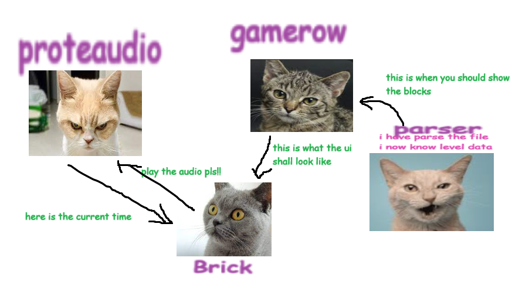

# HaskMania

A terminal-based 4k VSRG, written in Haskell and brick.

## Installation

### Building with Nix (Recommended)

A Nix devShell with the required dependencies is provided with the Nix flake, simply use `nix develop` to enter it.

### Building on Ubuntu WSL

```shell
# Install dependencies
$ sudo apt install libpulse-dev libgmp3-dev libsdl2-dev
# Install dependencies
$ cabal install
```

## Usage

```shell
$ cabal run . -- FILE VERSION
```

Where `FILE` is the path to the beatmap file and `VERSION` is the difficulty name, such as `easy`.

To exit the game, press the enter key.

Here are some sample beatmap files we used. For copyright reasons, they are not included in this repo. These links will expire in 2024 due to Discord API changes.

- [347779 sakuzyo - Altale no video.osz](https://cdn.discordapp.com/attachments/1157417217865023559/1185268918777024633/347779_sakuzyo_-_Altale_no_video.osz)
- [171421 M2U - Quo Vadis.osz](https://cdn.discordapp.com/attachments/1157417217865023559/1185268920253423686/171421_M2U_-_Quo_Vadis.osz)
- [1301740 M2U - Promise feat. Sherie.osz](https://cdn.discordapp.com/attachments/1157417217865023559/1185286890862162050/1301740_M2U_-_Promise_feat._Sherie.osz)

## Members

- David Li (A17966279, [huantianad](https://github.com/huantianad))
- Sean Yen (A16948219, [SheepTester](https://github.com/SheepTester))
- Gary Lin (A16915179, [Atlae](https://github.com/Atlae))
- Rohan Vanheusden (A17072826, [aemino](https://github.com/aemino))

## Milestone 1: Proposal


We intend to create a rhythm game in the terminal using Haskell and [`brick`][brick]. Specifically, the game will be a 4-key vertial scrolling rhythm game (4k VSRG) similar to existing games like [osu!mania][osu], [Quaver][quaver], and [DDR][ddr], where indicators glide down from the top, following the music's rhythm, and the goal is to press the corresponding key right as it lands on the bottom.

Architecturally, we are looking at using [`proteaaudio`][proteaaudio] to play audio. A major problem is the inability to read the current audio time to sync the game to the audio precisely.

For storing level data, we will implement a custom parser for the [`.osu`][osufile] file format, used by the rhythm game [osu][osu]. By using a standard file format, we're able to reuse existing levels made for other games.

There are many challenges to making the game itself. Our goal is to create a minimally working game that properly reads user input and can smoothly display the notes moving down the screen. We will then settle on more specific details, such as:

- The overall appearance of the game
- The scoring system
- Specific game mechanics
<!-- More description of how the game might work or looks in general? Maybe a better description of 4k in the first paragraph. Scoring system? -->

[brick]: https://hackage.haskell.org/package/brick
[proteaaudio]: https://hackage.haskell.org/package/proteaaudio
[osufile]: https://osu.ppy.sh/wiki/en/Client/File_formats/osu_%28file_format%29
[osu]: https://en.wikipedia.org/wiki/Osu!
[quaver]: https://quavergame.com/
[ddr]: https://en.wikipedia.org/wiki/Dance_Dance_Revolution

## Milestone 2: Updates

<!-- Prompt: What is the architecture of your application (the key components)? -->

Here is an overview of our application's architecture.



<!-- Prompt: What challenges (if any) did you have so far and how did you solve them? -->

Unsurprisingly, audio is a bit finicky. There appears to be a delay when playing/pausing the audio, and there's no way to keep the game in sync with the audio unless we modify the [`proteaaudio`][proteaaudio] library itself.

Another curiosity we ran into was that terminal characters are narrow and tall, and terminals are also usually in a landscape orientation. This means that there's a lot of column space to work with, but not as much row space. We had to consider whether it would be better to make our rhythm game's tracks horizontal to take advantage of more column space.

<!-- Prompt: Do you expect to meet your goals until the deadline? -->

We will meet our goals before the deadline.

<!-- Prompt: If not, how will you modify your goals? -->
